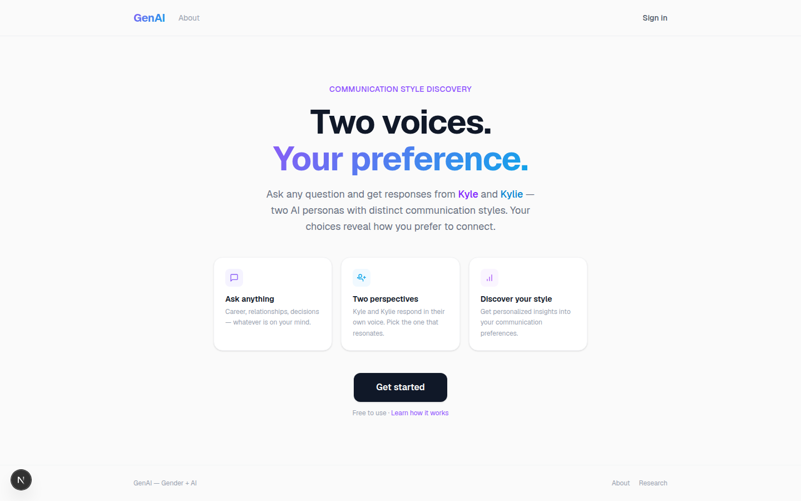

# GenAI — Two voices. Your preference.

Ask any question and get two responses side by side: one from Kyle, one from Kylie — two AI personas with distinct communication styles. The answers you pick build into a personalized report on how you prefer to communicate. An experiment in how gendered communication styles show up in AI, and what our reactions to them say about us.

## Screenshot



## How it works

1. Sign in and ask anything — career, relationships, decisions
2. Kyle and Kylie each answer in their own voice; pick the response that resonates
3. After enough picks, GenAI generates a behavioral report on your communication preferences

## Features

- **Dual-persona chat** — every prompt gets two parallel Claude responses with different style profiles
- **Model selector** — switch between Claude Haiku, Sonnet, and Opus per conversation
- **Multi-chat sidebar** with pin and delete
- **Communication-style reports** built from your choice history
- **Accounts and saved conversations** via Supabase

## Tech stack

- Next.js 16 (App Router) + React 19 + TypeScript
- [Claude API](https://docs.claude.com) via the Anthropic SDK, with Zod-validated structured outputs
- Supabase for auth and conversation storage
- Tailwind CSS 4
- Deployed on Vercel

## Why I built it

I wanted to explore a question that doesn't get asked much in AI products: when the same intelligence speaks in different voices, which one do people trust — and why? Building it also meant working through real product problems: streaming two model responses at once, structured output validation, and auth-scoped data in Supabase.

Built with [Claude Code](https://claude.com/claude-code).

## Running locally

```bash
npm install
npm run dev
```

Requires `ANTHROPIC_API_KEY`, `NEXT_PUBLIC_SUPABASE_URL`, and `NEXT_PUBLIC_SUPABASE_ANON_KEY` in `.env.local`. Supabase migrations are in `supabase/migrations`.
